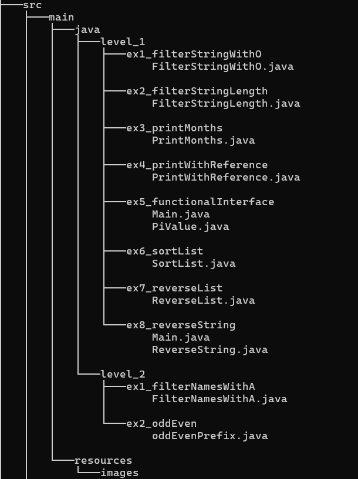

# Lambdas and Streams

estos ejercicios estan centrados en el uso de expresiones lambda, interfaces funcionales y Streams.

## Estructura del proyecto

## Tecnologías

* Java 21
* IntelliJ IDEA
* Java Standard Library

## Instalación y Ejecución:
* Clonar el repositorio.
* Abrir en IntelliJ o Eclipse.
* Ejecutar Main.java.

## Nivel 1

### Ejercicio 1 - FilterStringWithO

Devuelve las cadenas de una lista que contienen la letra `o`.

### Ejercicio 2 - FilterStringLenth

Devuelve las cadenas que contienen la letra `o` y tienen más de 5 caracteres.

### Ejercicio 3 - PrintMonths

Muestra los elementos de una lista utilizando una expresión lambda con `forEach()`.

### Ejercicio 4 - PrintWithReference

Muestra los elementos de una lista utilizando una referencia a método.

### Ejercicio 5 - PiValue

Crea una interfaz funcional con un método que devuelve el valor `3.1415` utilizando una expresión lambda.

### Ejercicio 6 - SortList

Ordena una lista de cadenas de menor a mayor según su longitud.

### Ejercicio 7 - ReverseList

Ordena una lista de cadenas de mayor a menor según su longitud.

### Ejercicio 8 - ReverseString

Crea una interfaz funcional y utiliza una expresión lambda para invertir una cadena de texto.

## Nivel 2

### Ejercicio 1 - FilterNamesWithA

Devuelve los nombres que empiezan por `A` mayúscula y tienen exactamente 3 caracteres.

### Ejercicio 2 - OddEvenPrefix

Devuelve un `String` donde cada número tiene delante `e` si es par y `o` si es impar.
